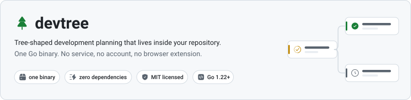
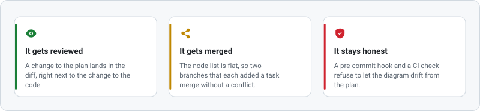

<picture>
  <source media="(prefers-color-scheme: dark)" srcset="docs/hero-dark.svg">
  
</picture>

[English](README.md) · [Русский](README.ru.md) · [中文](README.zh-CN.md) · **Deutsch** · [Français](README.fr.md)

[](https://github.com/SergeyLubivui-dev/devtree/actions/workflows/ci.yml)
[](https://github.com/SergeyLubivui-dev/devtree/releases/latest)
[](LICENSE)

Dein Plan ist eine Datei — `.devtree/tree.yaml` — und sie liegt direkt neben dem Code. Sie wird mit
dem Code versioniert, im Pull Request reviewt und zeilenweise gemergt. Daraus erzeugt devtree ein
[Mermaid](https://mermaid.js.org/)-Diagramm in `TREE.md` oder direkt in deine `README.md`, und eine
eigene Zeichnung als `.svg`. GitHub und GitLab rendern beides von Haus aus: keine Browser-Erweiterung,
kein Bild, das von Hand neu exportiert werden muss, nichts zu hosten.

---

## Warum der Plan ins Repository gehört

<picture>
  <source media="(prefers-color-scheme: dark)" srcset="docs/why-dark.svg">
  
</picture>

- **Er wird reviewt.** Eine Änderung am Plan steht im Diff, direkt neben der Änderung am Code.
- **Er lässt sich mergen.** Die Knotenliste ist flach, also mergen zwei Branches, die jeweils eine
  Aufgabe ergänzt haben, ohne Konflikt.
- **Er bleibt ehrlich.** Ein Pre-Commit-Hook und eine CI-Prüfung lassen das Diagramm nicht vom Plan
  abdriften.

Eine Roadmap im Ticketsystem entfernt sich von dem Branch, den sie beschreibt. Eine Roadmap im Wiki
wird genau einmal gelesen. Eine Roadmap im Repository ist eine Datei, für die es längst Gewohnheiten
gibt.

---

## Wie es funktioniert

<picture>
  <source media="(prefers-color-scheme: dark)" srcset="docs/pipeline-dark.svg">
  
</picture>

---

## Installation

```bash
go install github.com/SergeyLubivui-dev/devtree@latest
```

Fertige Binaries für Linux, macOS und Windows hängen samt Prüfsummen an jedem
[Release](https://github.com/SergeyLubivui-dev/devtree/releases/latest). Oder aus dem Quelltext
bauen — mehr als Go 1.22 braucht es nicht:

```bash
git clone https://github.com/SergeyLubivui-dev/devtree.git
cd devtree
go test ./...
go build -o devtree .
```

### Im Container

Wer gar nichts installieren möchte, hängt das Repository ein und startet das Image:

```bash
docker run --rm -v "$PWD:/work" ghcr.io/sergeylubivui-dev/devtree render
docker run --rm -v "$PWD:/work" ghcr.io/sergeylubivui-dev/devtree board
```

Unter Linux zusätzlich `--user "$(id -u):$(id -g)"`, damit die geschriebenen Dateien dir gehören und
nicht root. `latest` folgt dem letzten Release, `edge` folgt `main`; beide gibt es für `amd64` und
`arm64`. Im Image steckt git, also funktioniert dort auch `devtree sync` — der einzige Grund, warum es
nicht `FROM scratch` gebaut ist.

---

## Schnellstart

```bash
cd dein-projekt

devtree init --project "Payment Gateway" --repo https://github.com/acme/pay --hook --action

devtree add "Authentication"  -p mvp -b feat/auth -i 12 -o ann -s wip
devtree add "OAuth providers" -p authentication -b feat/oauth
devtree add "Password reset"  -p authentication -s blocked -n "wartet auf SMTP"

devtree ls                                   # der Baum im Terminal
devtree done oauth-providers
git add . && git commit -m "feat: oauth"     # der Hook aktualisiert das Diagramm
```

IDs entstehen aus den Titeln — aus "OAuth providers" wird `oauth-providers`, und nicht-lateinische
Titel werden transliteriert, damit die ID tippbar bleibt. Mit `--id` wählst du sie selbst.

---

## Rezepte für den Alltag

Kurze, echte Dinge, die man mit einem Plan tut. Eines kopieren, Wörter austauschen.

**Ein Feature anfangen und fertig machen.** Aufgabe und Branch werden zusammen benannt, also weiß
jeder, der das Diagramm liest, wo der Code liegt:

```bash
devtree add "Search filters" -p mvp -b feat/search -i 214 -o you -s wip
git switch -c feat/search
# ...Code schreiben...
devtree done search-filters
git commit -am "feat: search filters"        # der Hook aktualisiert das Diagramm
```

**Großes in Machbares zerlegen.** Elternknoten zählen ihre Kinder selbst, der Fortschritt eines
Meilensteins muss also nie von Hand nachgepflegt werden:

```bash
devtree add "Billing" -s wip
devtree add "Invoices" -p billing
devtree add "Refunds"  -p billing
devtree add "Dunning"  -p billing -s blocked -n "braucht die Payments-API"
devtree ls
```

**Ein Ticket übernehmen.** Mit der Issue-Nummer wird daraus ein Link in der Tabelle unter dem
Diagramm:

```bash
devtree add "Fix timezone drift" -i 512 -o ann -s wip --tags bug
```

**Parken, was gerade nicht geht.** Eine blockierte Aufgabe ohne Notiz ist das Einzige, was `check`
bemängelt: "blockiert" ohne Grund kann niemand aufgreifen.

```bash
devtree set password-reset -s blocked -n "wartet auf den SMTP-Vertrag"
devtree board -s blocked
```

**Montagmorgen in drei Befehlen:**

```bash
devtree board          # was läuft, was hängt, was wartet
devtree ls -s blocked  # nur die Zweige, die eine Entscheidung brauchen
devtree check          # steht irgendwo "fertig", obwohl darunter noch offene Arbeit liegt?
```

**Zwei Leute, zwei Branches, ein Plan.** Beide ergänzen Aufgaben, beide committen, und der Merge ist
langweilig: die Knotenliste ist flach und `.gitattributes` sagt `merge=union`. Sollten zwei Branches
zufällig dieselbe ID wählen, scheitert `devtree check` sofort und nennt das Duplikat.

---

## Das Board

Der Baum sagt, wie die Arbeit organisiert ist. Das Board sagt, in welchem Zustand sie heute Morgen
ist. Dieselbe Datei, zwei Fragen:

```bash
devtree board
```

```text
Payment Gateway

☐ not started · 1
  Apple Pay        Payments  #51

◐ in progress · 1
  OAuth providers  Authentication  !31

⛔ blocked · 1
  Password reset   Authentication  — wartet auf SMTP

✔ done · 1
  Stripe           Payments  !44
```

Aufs Board kommen nur Blätter. Ein Meilenstein ist ein Behälter und keine Aufgabe, und ein Board, das
Behälter neben der Arbeit darin auflistet, ist keines mehr — deshalb trägt jede Karte ihren
Meilenstein stattdessen als Brotkrume. Leere Spalten werden gar nicht erst gezeichnet.

Dasselbe Board gibt es als SVG; die Ausgabedatei muss nur `board.svg` heißen:

<picture>
  <source media="(prefers-color-scheme: dark)" srcset="docs/board-dark.svg">
  
</picture>

---

## Fertige Arbeit

Ein Plan, der jede jemals erledigte Aufgabe behält, ist kein Plan mehr, sondern ein Protokoll: Das
Board füllt sich mit Spalten erledigter Arbeit, und das Diagramm bekommt einen Schwanz, den niemand
liest. Das Archiv behält den Nachweis, ohne das Rauschen zu behalten.

```bash
devtree archive          # was fertig ist und umziehen könnte
devtree archive --all    # nach .devtree/archive.yaml verschieben
devtree archive v1       # oder nur diesen Zweig des Plans
devtree archive --list   # was bereits gegangen ist
devtree restore v1       # zurückholen, mit allem darunter
```

Bis du es sagst, bewegt sich nichts: `devtree archive` allein berichtet nur. Ein Knoten kommt
infrage, wenn sein ganzer Teilbaum `done` oder `dropped` ist — laufende Arbeit kann also nie
zusammen mit dem Meilenstein darüber verschwinden. Archivierte Aufgaben behalten ihren Elternknoten,
so erinnern sie sich, woher sie kamen; ist der beim Zurückholen verschwunden, kommt die Aufgabe als
Wurzel zurück und sagt es dir.

Das Archiv verwendet dasselbe Format wie der Plan: kein zweiter Parser, nichts Neues im Diff.

**Schließen, was git ohnehin schon weiß:**

```bash
devtree sync           # Aufgaben auflisten, deren Branch bereits gemergt ist
devtree sync --apply   # und sie als erledigt markieren
```

Der Befehl schlägt vor, statt zu handeln. git weiß, welche Branches gemergt wurden, aber nicht,
welche davon *fertig* gemergt wurden: ein hinter einem Feature-Flag gemergter Branch ist keine
erledigte Aufgabe. Es ist der einzige Befehl, der ein anderes Programm startet; alles andere
arbeitet allein auf der Datei.

---

## Befehle

| Befehl | Was er tut |
|---|---|
| `init [--project N] [--repo URL] [--outputs F] [--hook] [--action] [--empty]` | Legt `.devtree/tree.yaml`, `.gitattributes` und das erste Diagramm an |
| `add "Titel" [-p ID] [-s STATUS] [-b BRANCH] [-i N] [--pr N] [-o WER] [--tags a,b] [-n NOTIZ] [--id ID]` | Fügt eine Aufgabe hinzu |
| `set ID [--title T] [-s ...] [-p ...] [...]` | Ändert Felder; angefasst wird nur, was du übergibst |
| `done ID [ID...]` | Markiert Aufgaben als erledigt |
| `mv ID ELTERN\|root` | Hängt eine Aufgabe unter einen anderen Elternknoten |
| `rm ID [--cascade]` | Löscht eine Aufgabe; ohne `--cascade` rücken die Kinder zum Elternknoten auf |
| `ls [-s STATUS]` | Gibt den Baum im Terminal aus |
| `board [-s STATUS]` | Gibt die Arbeit nach Status gruppiert aus |
| `archive [ID...] [--all] [--list]` | Verschiebt fertige Zweige des Plans ins Archiv |
| `restore ID [ID...]` | Holt archivierte Arbeit zurück |
| `sync [--apply]` | Schließt Aufgaben, deren Branch git bereits gemergt hat |
| `render [--file F] [--quiet]` | Erzeugt alle Ausgabedateien neu |
| `check [--strict]` | Prüft den Plan — für CI und Hooks |
| `install hook\|action\|all` | Installiert Pre-Commit-Hook und GitHub Action |
| `outputs` | Gibt die Ausgabedateien aus |

Flags dürfen vor oder nach dem Titel stehen, beides ist dasselbe:

```bash
devtree add "Authentication" -p mvp -s wip
devtree add -p mvp -s wip "Authentication"
```

### Status

<picture>
  <source media="(prefers-color-scheme: dark)" srcset="docs/statuses-dark.svg">
  
</picture>

In der Datei landet immer die kanonische Schreibweise, egal welche Kurzform du tippst.

---

## Das Dateiformat

```yaml
version: 1
project: "Payment Gateway"
repo: "https://github.com/acme/pay"
outputs: "TREE.md"
nodes:
  - id: "mvp"
    title: "MVP"
    status: "in_progress"
  - id: "auth"
    title: "Authentication"
    status: "in_progress"
    parent: "mvp"
    branch: "feat/auth"
    issue: "12"
    owner: "ann"
```

Die Liste ist **flach**; die Hierarchie steckt im Feld `parent`. Das ist ein bewusster Tausch.
Verschachtelung hieße, dass das Hinzufügen einer Aufgabe einen bestehenden Block umschreibt — genau
die Form, an der zwei Feature-Branches kollidieren. Eine flache Liste macht aus "Aufgabe hinzufügen"
ein "Zeilen anhängen", also mergen parallele Branches sauber, und `init` schreibt zusätzlich
`merge=union` in `.gitattributes`. Schlimmstenfalls entsteht eine doppelte ID, und die fängt
`devtree check` sofort ab.

Die Datei darf jederzeit von Hand bearbeitet werden. Der Parser ist streng und nennt die Zeile:

```text
devtree: .devtree/tree.yaml: line 14: unknown node field "assignee"
```

---

## Automatisierung

**Pre-Commit-Hook** — `devtree install hook`. Prüft den Plan, erzeugt alle Ausgaben neu und legt das
Ergebnis mit in den Commit. Ein vorhandener Hook bleibt als `pre-commit.devtree-backup` erhalten.
Kolleginnen und Kollegen ohne devtree werden nicht blockiert: der Hook merkt, dass das Binary fehlt,
und tritt zur Seite.

**GitHub Action** — `devtree install action`. Bei `pull_request` schlägt der Lauf fehl, wenn das
Diagramm veraltet ist, damit die Autorin es im eigenen Diff korrigiert; bei `push` auf den
Hauptbranch wird es automatisch aktualisiert und committet.

---

## Zeichnen als SVG

Mermaid hat eine Obergrenze: GitHub rendert es mit striktem Sanitizer und einer CSP auf Seitenebene,
ein Knoten im Diagramm kann also weder Symbol noch Link tragen. Eine Datei, die devtree selbst
zeichnet, hat diese Grenze nicht. Der Dateiname entscheidet alles:

| Dateiname | Was gezeichnet wird |
|---|---|
| `TREE.md`, `README.md` | der Mermaid-Block zwischen den Markern |
| `docs/tree.svg` | der Baum, helle Palette |
| `docs/tree-dark.svg` | der Baum, dunkle Palette |
| `docs/board.svg` | das Board |

Bewegt wird nur, was Information trägt: ein Strich wandert die Kante entlang, die zu laufender Arbeit
führt; ein Symbol dreht sich, wenn die Aufgabe in Arbeit ist, und atmet, wenn sie blockiert ist — der
eine Zustand, für den es sich lohnt, den Lesenden zu unterbrechen; ein Fortschrittsbalken wächst beim
Laden einmal ein; Karten blenden nacheinander auf, statt alle gleichzeitig da zu sein. Oben in dieser
Datei zieht ein Kartenband endlos vorbei. Alles andere steht still.

Wer vom System weniger Bewegung anfordert, bekommt ein stehendes Bild. Beim Drucken werden die
Animationen ganz abgeschaltet: ein Renderer, der das erste Bild einer Einblendung einfriert, würde
sonst eine leere Karte aufs Papier bringen.

Die Glyphen stammen aus [Reicon](https://reicon.dev) (MIT) als Pfaddaten in `internal/icons` — siehe
[NOTICE](NOTICE). Beim Zeichnen wird nichts nachgeladen, und das Binary hat weiterhin keine
Abhängigkeiten.

---

## Grenzen

- Das Speicherformat ist eine strenge Teilmenge von YAML: eine flache Liste skalarer Felder. Anker,
  mehrzeilige Blöcke und verschachtelte Strukturen werden mit Zeilennummer abgelehnt.
- Nichts, was in einer README gerendert wird, ist anklickbar: GitHubs Mermaid ignoriert
  `click`-Direktiven, und ein als Bild ausgeliefertes SVG läuft in einer Sandbox. Die Links stehen in
  der eingeklappten Tabelle unter dem Diagramm.
- Text im SVG wird geschätzt statt aus Font-Metriken gemessen — sonst müsste eine Schrift mitgeliefert
  werden. Karten sind deshalb ein paar Pixel großzügiger.
- Sehr breite Bäume (Hunderte Knoten) rendert der Browser langsam; verteile sie mit `--outputs` auf
  mehrere Ausgabedateien.

---

## Lizenz

[MIT](LICENSE) © SergeyLubivui-dev

Die Vektor-Glyphen in `internal/icons` stammen aus [Reicon](https://reicon.dev), ebenfalls MIT —
siehe [NOTICE](NOTICE).

> Die vollständige Dokumentation, samt Abschnitt zum Aufbau des Projekts, steht in der
> [englischen Fassung](README.md).
