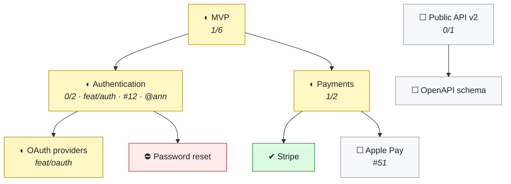

<picture>
  <source media="(prefers-color-scheme: dark)" srcset="docs/hero-dark.svg">
  
</picture>

**English** · [Русский](README.ru.md) · [中文](README.zh-CN.md) · [Deutsch](README.de.md) · [Français](README.fr.md)

[](https://github.com/SergeyLubivui-dev/devtree/actions/workflows/ci.yml)
[](https://pkg.go.dev/github.com/SergeyLubivui-dev/devtree)
[](https://github.com/SergeyLubivui-dev/devtree/releases/latest)
[](LICENSE)

Your plan is a file — `.devtree/tree.yaml` — that sits next to the code. It is versioned with the
code, reviewed in the pull request, and merged line by line. From it, devtree generates a
[Mermaid](https://mermaid.js.org/) diagram into `TREE.md` or straight into your `README.md`, and a
drawing of its own into `.svg`. GitHub and GitLab render both natively. No browser extension, no
image to regenerate by hand, nothing to host.

---

## Why keep the plan in the repository

<picture>
  <source media="(prefers-color-scheme: dark)" srcset="docs/why-dark.svg">
  
</picture>

A roadmap in a tracker drifts away from the branch it describes. A roadmap in a wiki is read once
and never again. A roadmap in the repository is a file people already have habits for.

---

## How it works

<picture>
  <source media="(prefers-color-scheme: dark)" srcset="docs/pipeline-dark.svg">
  
</picture>

---

## What it looks like

The Mermaid backend, which GitHub draws right here in the page:



The same plan in your terminal:

```text
Payment Gateway

◐ MVP  (mvp)  [1/6]
├─ ◐ Authentication  (authentication)  feat/auth  #12  @ann  [0/2]
│  ├─ ◐ OAuth providers  (oauth-providers)  feat/oauth
│  └─ ⛔ Password reset  (password-reset)
└─ ◐ Payments  (payments)  [1/2]
   ├─ ✔ Stripe  (stripe)
   └─ ☐ Apple Pay  (apple-pay)  #51
☐ Public API v2  (public-api-v2)  [0/1]
└─ ☐ OpenAPI schema  (openapi-schema)

██░░░░░░░░░░░░░░░░░░  1/9
```

And the SVG backend, which devtree draws itself — [further down](#devtrees-own-plan), rendering this
repository's own plan.

---

## Install

```bash
go install github.com/SergeyLubivui-dev/devtree@latest
```

Prebuilt binaries for Linux, macOS, and Windows are attached to every
[release](https://github.com/SergeyLubivui-dev/devtree/releases/latest), with checksums.

Or build from source — Go 1.22 or newer, nothing else:

```bash
git clone https://github.com/SergeyLubivui-dev/devtree.git
cd devtree
go test ./...
go build -o devtree .
```

---

## Quickstart

```bash
cd your-project

devtree init --project "Payment Gateway" --repo https://github.com/acme/pay --hook --action

devtree add "Authentication"  -p mvp -b feat/auth -i 12 -o ann -s wip
devtree add "OAuth providers" -p authentication -b feat/oauth
devtree add "Password reset"  -p authentication -s blocked -n "waiting on SMTP"

devtree ls                                   # the tree, in your terminal
devtree done oauth-providers
git add . && git commit -m "feat: oauth"     # the hook refreshes the diagram for you
```

IDs are derived from titles — "OAuth providers" becomes `oauth-providers`, and non-Latin titles are
transliterated so the ID stays typeable. Pass `--id` when you want to choose one yourself.

---

## Everyday recipes

Short, real things people do with a plan. Copy one and change the words.

**Start a feature, finish a feature.** The task and the branch are named together, so anyone reading
the diagram knows where the code is:

```bash
devtree add "Search filters" -p mvp -b feat/search -i 214 -o you -s wip
git switch -c feat/search
# ...write the code...
devtree done search-filters
git commit -am "feat: search filters"        # the hook refreshes the diagram
```

**Break something big into something doable.** Parents count their children automatically, so the
milestone reports progress you never have to update by hand:

```bash
devtree add "Billing" -s wip
devtree add "Invoices" -p billing
devtree add "Refunds"  -p billing
devtree add "Dunning"  -p billing -s blocked -n "needs the payments API"
devtree ls
```

```text
◐ Billing  (billing)  [0/3]
├─ ☐ Invoices  (invoices)
├─ ☐ Refunds  (refunds)
└─ ⛔ Dunning  (dunning)
```

**Pick up a ticket.** Give it the issue number and it becomes a link in the table under the diagram:

```bash
devtree add "Fix timezone drift" -i 512 -o ann -s wip --tags bug
```

**Park what you cannot finish.** A blocked task with no note is the one thing `check` complains
about, because "blocked" without a reason is a task nobody can pick up:

```bash
devtree set password-reset -s blocked -n "waiting on the SMTP contract"
devtree board -s blocked
```

**Monday morning, in three commands:**

```bash
devtree board          # what is in flight, what is stuck, what is waiting
devtree ls -s blocked  # only the branches that need a decision
devtree check          # anything marked done that still has open work under it?
```

**Two people, two branches, one plan.** Both add tasks, both commit, and the merge is boring — the
node list is flat and `.gitattributes` says `merge=union`. If two branches happen to pick the same
ID, `devtree check` fails on the spot with the duplicate named.

---

## The board

The tree says how the work is organized. The board says what state it is in this morning — same
file, different question:

```bash
devtree board
```

```text
Payment Gateway

☐ not started · 1
  Apple Pay        Payments  #51

◐ in progress · 1
  OAuth providers  Authentication  !31

⛔ blocked · 1
  Password reset   Authentication  — waiting on SMTP

✔ done · 1
  Stripe           Payments  !44

██░░░░░░░░░░░░░░░░░░  1/7
```

Only leaves appear. A milestone is a container, not a task, and a board that lists containers next
to the work inside them stops being a board — so each card carries its milestone as a breadcrumb
instead. Empty columns are left out entirely: a board with nothing blocked should not spend a fifth
of its width saying so.

The same board renders to SVG. Name an output `board.svg` (or `anything.board.svg`) and it is drawn
as columns instead of a tree:

```bash
devtree init --outputs "docs/tree.svg, docs/board.svg, docs/board-dark.svg"
```

<picture>
  <source media="(prefers-color-scheme: dark)" srcset="docs/board-dark.svg">
  
</picture>

---

## Finished work

A plan that keeps every task ever completed stops being a plan and becomes a log: the board fills
with columns of done work and the diagram grows a tail nobody reads. Archiving keeps the record
without keeping the noise.

```bash
devtree archive          # what is finished and could move
devtree archive --all    # move it into .devtree/archive.yaml
devtree archive v1       # or just this branch of the plan
devtree archive --list   # what has already left
devtree restore v1       # bring it back, with everything under it
```

Nothing moves until you say so — plain `devtree archive` only reports. A node qualifies only when
its whole subtree is done or dropped, so live work can never vanish along with the milestone above
it. Archived tasks keep the parent they had, which is how they remember where they came from; if
that parent is gone by the time you restore, the task comes back as a root and tells you.

The archive uses the same format as the plan, so there is no second parser to learn and nothing new
to review in a diff.

**Closing what git already knows about:**

```bash
devtree sync           # list tasks whose branch is already merged
devtree sync --apply   # mark them done
```

It proposes instead of acting, because git knows which branches were merged but not which of them
were merged *finished* — a branch merged behind a feature flag is not a task that is done. This is
the only command that runs another program; everything else works on the file alone, which is what
lets devtree run in a tarball or a container with no repository at all.

---

## Commands

| Command | What it does |
|---|---|
| `init [--project N] [--repo URL] [--outputs F] [--hook] [--action] [--empty]` | Creates `.devtree/tree.yaml`, `.gitattributes`, and the first diagram. `--outputs` takes any mix of `.md` and `.svg` files |
| `add "Title" [-p ID] [-s STATUS] [-b BRANCH] [-i N] [--pr N] [-o WHO] [--tags a,b] [-n NOTE] [--id ID]` | Adds a task |
| `set ID [--title T] [-s ...] [-p ...] [...]` | Changes fields on a task; only the flags you pass are touched |
| `done ID [ID...]` | Marks tasks done |
| `mv ID PARENT\|root` | Re-parents a task |
| `rm ID [--cascade]` | Deletes a task; without `--cascade` its children move up to its parent |
| `ls [-s STATUS]` | Prints the tree in the terminal |
| `board [-s STATUS]` | Prints the work grouped by status, like a board |
| `archive [ID...] [--all] [--list]` | Moves finished branches of the plan into the archive |
| `restore ID [ID...]` | Brings archived work back |
| `sync [--apply]` | Closes tasks whose branch git has already merged |
| `render [--file F] [--quiet]` | Regenerates every output |
| `check [--strict]` | Validates the plan — for CI and hooks |
| `install hook\|action\|all` | Installs the pre-commit hook and the GitHub Action |
| `outputs` | Prints the files the diagram is written to |

Flags may come before or after the title, so both of these do the same thing:

```bash
devtree add "Authentication" -p mvp -s wip
devtree add -p mvp -s wip "Authentication"
```

### Statuses

<picture>
  <source media="(prefers-color-scheme: dark)" srcset="docs/statuses-dark.svg">
  
</picture>

The canonical spelling is what lands in the file, whichever shorthand you type.

---

## The file format

```yaml
# Development tree. Edit by hand or through the `devtree` command.
# After editing, run `devtree render` to refresh the diagram.
version: 1
project: "Payment Gateway"
repo: "https://github.com/acme/pay"
outputs: "TREE.md"
nodes:
  - id: "mvp"
    title: "MVP"
    status: "in_progress"
  - id: "authentication"
    title: "Authentication"
    status: "in_progress"
    parent: "mvp"
    branch: "feat/auth"
    issue: "12"
    owner: "ann"
  - id: "password-reset"
    title: "Password reset"
    status: "blocked"
    parent: "authentication"
    note: "waiting on SMTP"
```

The list is **flat**; the hierarchy comes from the `parent` field. That is a deliberate trade.
Nesting would mean that adding a task rewrites an existing block — exactly the shape that makes two
feature branches conflict. A flat list turns "add a task" into "append lines", so parallel branches
merge cleanly, and `init` writes a `merge=union` rule into `.gitattributes` to finish the job. Worst
case you end up with a duplicate ID, which `devtree check` catches on the spot.

Edit the file by hand whenever you like. The parser is strict and tells you the line number:

```text
devtree: .devtree/tree.yaml: line 14: unknown node field "assignee"
```

---

## Automation

**Pre-commit hook** — `devtree install hook`

Validates the plan, regenerates every output, and stages the result along with your commit. An
existing hook is preserved as `pre-commit.devtree-backup`. Teammates who have not installed devtree
are not blocked: the hook notices the binary is missing and steps aside.

**GitHub Action** — `devtree install action`

- on `pull_request`: fails if the diagram is stale, so the author fixes it in their own diff;
- on `push` to the default branch: refreshes the diagram and commits it.

---

## Rendering into your README

```bash
devtree init --outputs "README.md"
```

The block is written between the `<!-- devtree:begin -->` and `<!-- devtree:end -->` markers, each on
a line of its own. If the markers are not there yet, the block is appended once and updated in place
from then on — so put the empty pair wherever you want the diagram to appear. Everything outside
them is left exactly as you wrote it, and re-rendering an unchanged plan rewrites nothing at all.

Only markers that start their own line count. Prose that mentions them mid-sentence — the paragraph
you are reading, for instance — is left alone.

Issue and pull request links are built from `repo`. If `repo` is not set, devtree falls back to
relative links (`../../issues/12`), which GitHub resolves correctly for files in the repository root
and which survive a fork or a move to another host.

---

## Drawing to SVG

Mermaid has a ceiling. GitHub renders it with a strict sanitizer and a page-level CSP, so a diagram
node cannot carry an icon or a link no matter how the label is written. A file devtree draws itself
has no such ceiling — so name an output `.svg` and you get the native renderer instead:

```bash
devtree init --outputs "TREE.md, docs/tree.svg, docs/tree-dark.svg"
```

The name decides everything, so `outputs` stays a plain list of destinations and `devtree render`
needs no arguments to reproduce it:

| File name | What gets drawn |
|---|---|
| `TREE.md`, `README.md` | the Mermaid block, between markers |
| `docs/tree.svg` | the tree, light palette |
| `docs/tree-dark.svg` | the tree, dark palette |
| `docs/board.svg` | the board |
| `docs/plan.board-dark.svg` | the board, dark, under a different name |

Point a `<picture>` at a light and dark pair and GitHub switches it with the reader's theme:

```html
<picture>
  <source media="(prefers-color-scheme: dark)" srcset="docs/tree-dark.svg">
  
</picture>
```

What the drawing adds over the Mermaid block: status glyphs on a 24×24 grid, a stripe of the status
color running the full height of each card, a progress bar and a completion ratio on every parent,
branch, issue, pull request, owner and tags on a second line under each title, a status key along
the bottom, and rounded elbow connectors that stay readable when a milestone grows a dozen children.

### Motion that means something

Three things move, and each one is information rather than decoration:

| | |
|---|---|
| A dash travels down an edge | that edge leads into work that is in progress — it marks the live path through the plan |
| A glyph turns | that task is in flight right now |
| A bar grows in, once | how much of a milestone is finished |

Everything else holds still. The motion is CSS inside the file: GitHub serves repository SVGs under
`default-src 'none'; style-src 'unsafe-inline'; sandbox`, which permits a stylesheet and forbids
script, so declarative animation is the only kind that survives — and the only kind worth having in
a diagram. Readers who ask their system for less motion get a still picture, because every animated
element is drawn over something that already reads correctly without it.

The output is self-contained by design — no external fonts, no images, no script, no CSS custom
properties. GitHub serves repository SVGs under `default-src 'none'; sandbox`, and everything in the
file survives that. The one thing sandboxing costs is interactivity: an SVG rendered as an image
cannot carry links, so branch and issue links still live in the table under the Mermaid block.

Glyphs are vendored from [Reicon](https://reicon.dev) (MIT) as path data in `internal/icons` — see
[NOTICE](NOTICE). Nothing is fetched at render time, and the binary still has no dependencies. Every
picture in this README is drawn by the same code that draws your plan; `go run ./internal/art`
regenerates them, and CI fails if they drift.

---

## How it is built

<picture>
  <source media="(prefers-color-scheme: dark)" srcset="docs/architecture-dark.svg">
  
</picture>

`internal/tree` imports nothing but the standard library. It does not know that a file format
exists, and it certainly does not know about Mermaid — which is why the rules about what a valid
plan *is* live in one place and stay there. Everything below the CLI is silent: no printing, no
`os.Exit`, errors returned as values. `App` takes its working directory and its two writers as
fields, so the test suite drives whole commands against a temporary directory and reads back exactly
what a user would have seen.

```bash
go test ./...
go vet ./...
```

---

## Limitations

- The storage format is a strict subset of YAML — a flat list of scalar fields. Anchors, multi-line
  block scalars, and nested mappings are not supported and will be rejected with a line number.
- Nothing rendered into a README is clickable: GitHub's Mermaid ignores `click` directives, and an
  SVG served as an image is sandboxed. Links live in the collapsed table under the Mermaid block.
  An interactive HTML export is on the plan below.
- Text in the SVG output is measured by estimate rather than by font metrics — shipping real metrics
  would mean shipping a font. Cards are sized a few pixels generously to compensate.
- Very wide trees (hundreds of nodes) render slowly in the browser. Split them across several output
  files with `--outputs`.

---

## devtree's own plan

Both of these come from the same `.devtree/tree.yaml` in this repository, regenerated on every
push. First the SVG backend — GitHub swaps the file when you switch themes:

<picture>
  <source media="(prefers-color-scheme: dark)" srcset="docs/tree-dark.svg">
  
</picture>

And the same plan as a Mermaid block, injected straight into this README:

<!-- devtree:begin -->
<!-- Generated by devtree. Do not edit by hand: edit .devtree/tree.yaml instead. -->

## 🌳 devtree

███████████░░░░░░░░░ **13 / 22** tasks done

```mermaid
flowchart TD
    classDef todo fill:#f6f8fa,stroke:#8c959f,color:#1f2328
    classDef in_progress fill:#fff8c5,stroke:#bf8700,color:#1f2328
    classDef blocked fill:#ffebe9,stroke:#cf222e,color:#1f2328
    classDef done fill:#dafbe1,stroke:#1a7f37,color:#1f2328
    classDef dropped fill:#eaeef2,stroke:#8c959f,color:#6e7781,stroke-dasharray:4 3
    n_v0_1["✔ v0.1 - first release<br/><i>6/6</i>"]:::done
    n_v0_1 --> n_domain
    n_domain["✔ Domain model and validation"]:::done
    n_v0_1 --> n_format
    n_format["✔ Strict YAML subset parser"]:::done
    n_v0_1 --> n_diagram
    n_diagram["✔ Mermaid renderer"]:::done
    n_v0_1 --> n_cli
    n_cli["✔ Command line"]:::done
    n_v0_1 --> n_automation
    n_automation["✔ Pre-commit hook and GitHub Action"]:::done
    n_v0_1 --> n_tests
    n_tests["✔ Test suite"]:::done
    n_v0_2["◐ v0.2 - sharper day-to-day use<br/><i>5/10</i>"]:::in_progress
    n_v0_2 --> n_filters
    n_filters["☐ Filter ls by owner and tag"]:::todo
    n_v0_2 --> n_focus
    n_focus["☐ Render one subtree with --root"]:::todo
    n_v0_2 --> n_open
    n_open["☐ devtree open ID - jump to the issue or PR"]:::todo
    n_v0_2 --> n_history
    n_history["☐ Progress history from git log"]:::todo
    n_v0_2 --> n_svg_output
    n_svg_output["✔ Native SVG output with embedded icons"]:::done
    n_v0_2 --> n_html_export
    n_html_export["☐ Interactive HTML export"]:::todo
    n_v0_2 --> n_animation
    n_animation["✔ Animation in the SVG output"]:::done
    n_v0_2 --> n_board
    n_board["✔ Board layout, in the terminal and in SVG"]:::done
    n_v0_2 --> n_archive
    n_archive["✔ Archive and restore finished work"]:::done
    n_v0_2 --> n_sync
    n_sync["✔ Close tasks from merged branches"]:::done
    n_distribution["◐ Distribution<br/><i>1/3</i>"]:::in_progress
    n_distribution --> n_binaries
    n_binaries["✔ Prebuilt binaries on every tag"]:::done
    n_distribution --> n_homebrew
    n_homebrew["☐ Homebrew tap"]:::todo
    n_distribution --> n_gitlab
    n_gitlab["☐ GitLab CI template"]:::todo
```



> ☐ not started · ◐ in progress · ⛔ blocked · ✔ done · ✖ dropped

<!-- devtree:end -->

## License

[MIT](LICENSE) © SergeyLubivui-dev

The vector glyphs in `internal/icons` are vendored from [Reicon](https://reicon.dev), also MIT —
see [NOTICE](NOTICE).
