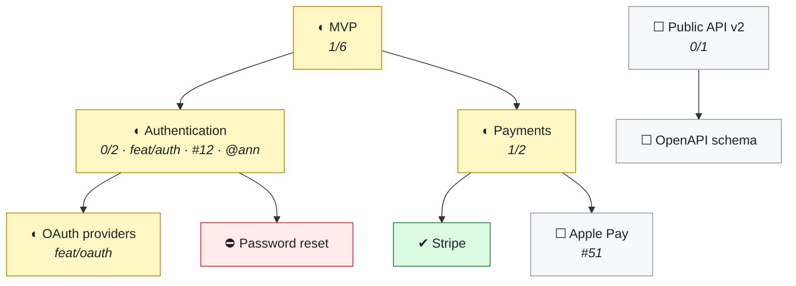

# devtree

**Tree-shaped development planning that lives inside your repository and draws itself in the GitHub viewport.**

[](https://github.com/SergeyLubivui-dev/devtree/actions/workflows/ci.yml)
[](https://pkg.go.dev/github.com/SergeyLubivui-dev/devtree)


[](LICENSE)

One Go binary. No dependencies, no service, no account.

Your plan is a file — `.devtree/tree.yaml` — that sits next to the code. It is versioned with the
code, reviewed in the pull request, and merged line by line. From it, devtree generates a
[Mermaid](https://mermaid.js.org/) diagram into `TREE.md` or straight into your `README.md`, and
GitHub and GitLab render it natively. No browser extension, no image to regenerate, nothing to host.

---

## Why

A roadmap in a tracker drifts away from the branch it describes. A roadmap in a wiki is read once
and never again. Put it in the repository and three things follow for free:

| | |
|---|---|
| **It gets reviewed** | A change to the plan shows up in the diff, next to the change to the code. |
| **It gets merged** | The node list is flat, so two branches that each added a task merge cleanly. |
| **It stays honest** | A pre-commit hook and a CI check refuse to let the diagram drift from the plan. |

---

## What it looks like

This is a real `devtree` diagram — GitHub draws it right here in the page:



> ☐ not started · ◐ in progress · ⛔ blocked · ✔ done · ✖ dropped

The same plan in the terminal:

```text
Payment Gateway

◐ MVP  (mvp)  [1/6]
├─ ◐ Authentication  (authentication)  feat/auth  #12  @ann  [0/2]
│  ├─ ◐ OAuth providers  (oauth-providers)  feat/oauth
│  └─ ⛔ Password reset  (password-reset)
└─ ◐ Payments  (payments)  [1/2]
   ├─ ✔ Stripe  (stripe)
   └─ ☐ Apple Pay  (apple-pay)  #51
☐ Public API v2  (public-api-v2)  [0/1]
└─ ☐ OpenAPI schema  (openapi-schema)

██░░░░░░░░░░░░░░░░░░  1/9
```

---

## Install

```bash
go install github.com/SergeyLubivui-dev/devtree@latest
```

Or build it from source — Go 1.22 or newer, nothing else:

```bash
git clone https://github.com/SergeyLubivui-dev/devtree.git
cd devtree
go test ./...
go build -o devtree .
```

Cross-compiling is the usual one-liner:

```bash
GOOS=darwin GOARCH=arm64 go build -o devtree .
GOOS=windows GOARCH=amd64 go build -o devtree.exe .
```

---

## Quickstart

```bash
cd your-project

devtree init --project "Payment Gateway" --repo https://github.com/acme/pay --hook --action

devtree add "Authentication"  -p mvp -b feat/auth -i 12 -o ann -s wip
devtree add "OAuth providers" -p authentication -b feat/oauth
devtree add "Password reset"  -p authentication -s blocked -n "waiting on SMTP"

devtree ls                                   # the tree, in your terminal
devtree done oauth-providers
git add . && git commit -m "feat: oauth"     # the hook refreshes TREE.md for you
```

IDs are derived from titles — "OAuth providers" becomes `oauth-providers`, and non-Latin titles are
transliterated so the ID stays typeable. Pass `--id` when you want to choose one yourself.

---

## Commands

| Command | What it does |
|---|---|
| `init [--project N] [--repo URL] [--outputs F] [--hook] [--action] [--empty]` | Creates `.devtree/tree.yaml`, `.gitattributes`, and the first diagram |
| `add "Title" [-p ID] [-s STATUS] [-b BRANCH] [-i N] [--pr N] [-o WHO] [--tags a,b] [-n NOTE] [--id ID]` | Adds a task |
| `set ID [--title T] [-s ...] [-p ...] [...]` | Changes fields on a task; only the flags you pass are touched |
| `done ID [ID...]` | Marks tasks done |
| `mv ID PARENT\|root` | Re-parents a task |
| `rm ID [--cascade]` | Deletes a task; without `--cascade` its children move up to its parent |
| `ls [-s STATUS]` | Prints the tree in the terminal |
| `render [--file F] [--quiet]` | Regenerates the diagram |
| `check [--strict]` | Validates the plan — for CI and hooks |
| `install hook\|action\|all` | Installs the pre-commit hook and the GitHub Action |
| `outputs` | Prints the files the diagram is written to |

Statuses are `todo`, `in_progress`, `blocked`, `done`, and `dropped`. Shorthand works everywhere a
status is accepted: `wip`, `b`, `d`, `x`, `ok`, `doing`, `cancel`, and friends.

Flags may come before or after the title, so both of these do the same thing:

```bash
devtree add "Authentication" -p mvp -s wip
devtree add -p mvp -s wip "Authentication"
```

---

## The file format

```yaml
# Development tree. Edit by hand or through the `devtree` command.
# After editing, run `devtree render` to refresh the diagram.
version: 1
project: "Payment Gateway"
repo: "https://github.com/acme/pay"
outputs: "TREE.md"
nodes:
  - id: "mvp"
    title: "MVP"
    status: "in_progress"
  - id: "authentication"
    title: "Authentication"
    status: "in_progress"
    parent: "mvp"
    branch: "feat/auth"
    issue: "12"
    owner: "ann"
  - id: "password-reset"
    title: "Password reset"
    status: "blocked"
    parent: "authentication"
    note: "waiting on SMTP"
```

The list is **flat**; the hierarchy comes from the `parent` field. That is a deliberate trade.
Nesting would mean that adding a task rewrites an existing block — exactly the shape that makes two
feature branches conflict. A flat list turns "add a task" into "append lines", so parallel branches
merge cleanly, and `init` writes a `merge=union` rule into `.gitattributes` to finish the job. Worst
case you end up with a duplicate ID, which `devtree check` catches on the spot.

Edit the file by hand whenever you like. The parser is strict and tells you the line number:

```text
devtree: .devtree/tree.yaml: line 14: unknown node field "assignee"
```

---

## Automation

**Pre-commit hook** — `devtree install hook`

Validates the plan, regenerates the diagram, and stages the result along with your commit. An
existing hook is preserved as `pre-commit.devtree-backup`. Teammates who have not installed devtree
are not blocked: the hook notices the binary is missing and steps aside.

**GitHub Action** — `devtree install action`

- on `pull_request`: fails if the diagram is stale, so the author fixes it in their own diff;
- on `push` to the default branch: refreshes the diagram and commits it.

---

## Rendering into your README

```bash
devtree init --outputs "README.md"
```

The block is written between the `<!-- devtree:begin -->` and `<!-- devtree:end -->` markers, each on
a line of its own. If the markers are not there yet, the block is appended once and updated in place
from then on — so put the empty pair wherever you want the diagram to appear. Everything outside
them is left exactly as you wrote it, and re-rendering an unchanged plan rewrites nothing at all.

Only markers that start their own line count. Prose that mentions them mid-sentence — the paragraph
you are reading, for instance — is left alone.

Issue and pull request links are built from `repo`. If `repo` is not set, devtree falls back to
relative links (`../../issues/12`), which GitHub resolves correctly for files in the repository root
and which survive a fork or a move to another host.

---

## How it is built

Four layers, and the dependencies only ever point inward:

```text
main.go                  ~20 lines: parse nothing, print nothing, just wire and exit
└── internal/cli         flags, dispatch, and every line the user sees
    ├── internal/store   the strict YAML subset: parse, marshal, atomic save
    ├── internal/render  Mermaid, Markdown, ASCII — pure string functions
    ├── internal/scaffold  hook, workflow, and .gitattributes templates
    └── internal/tree    the domain: nodes, parents, statuses, validation
```

`internal/tree` imports nothing but the standard library. It does not know that a file format
exists, and it certainly does not know about Mermaid — which is why the rules about what a valid
plan *is* live in one place and stay there. Everything below the CLI is silent: no printing, no
`os.Exit`, errors returned as values. `App` takes its working directory and its two writers as
fields, so the test suite drives whole commands against a temporary directory and reads back exactly
what a user would have seen.

Run the tests the usual way:

```bash
go test ./...
go vet ./...
```

---

## Limitations

- The storage format is a strict subset of YAML — a flat list of scalar fields. Anchors, multi-line
  block scalars, and nested mappings are not supported and will be rejected with a line number.
- GitHub's Mermaid renderer ignores `click` directives, so a node in the diagram cannot itself be a
  link. The links live in the collapsed table underneath instead.
- Very wide trees (hundreds of nodes) render slowly in the browser. Split them across several output
  files with `--outputs`.

---

## devtree's own plan

Rendered by devtree, from this repository, on every push:

<!-- devtree:begin -->
<!-- Generated by devtree. Do not edit by hand: edit .devtree/tree.yaml instead. -->

## 🌳 devtree

██████████░░░░░░░░░░ **8 / 16** tasks done

```mermaid
flowchart TD
    classDef todo fill:#f6f8fa,stroke:#8c959f,color:#1f2328
    classDef in_progress fill:#fff8c5,stroke:#bf8700,color:#1f2328
    classDef blocked fill:#ffebe9,stroke:#cf222e,color:#1f2328
    classDef done fill:#dafbe1,stroke:#1a7f37,color:#1f2328
    classDef dropped fill:#eaeef2,stroke:#8c959f,color:#6e7781,stroke-dasharray:4 3
    n_v0_1["✔ v0.1 - first release<br/><i>6/6</i>"]:::done
    n_v0_1 --> n_domain
    n_domain["✔ Domain model and validation"]:::done
    n_v0_1 --> n_format
    n_format["✔ Strict YAML subset parser"]:::done
    n_v0_1 --> n_diagram
    n_diagram["✔ Mermaid renderer"]:::done
    n_v0_1 --> n_cli
    n_cli["✔ Command line"]:::done
    n_v0_1 --> n_automation
    n_automation["✔ Pre-commit hook and GitHub Action"]:::done
    n_v0_1 --> n_tests
    n_tests["✔ Test suite"]:::done
    n_v0_2["☐ v0.2 - sharper day-to-day use<br/><i>0/4</i>"]:::todo
    n_v0_2 --> n_filters
    n_filters["☐ Filter ls by owner and tag"]:::todo
    n_v0_2 --> n_focus
    n_focus["☐ Render one subtree with --root"]:::todo
    n_v0_2 --> n_open
    n_open["☐ devtree open ID - jump to the issue or PR"]:::todo
    n_v0_2 --> n_history
    n_history["☐ Progress history from git log"]:::todo
    n_distribution["☐ Distribution<br/><i>1/3</i>"]:::todo
    n_distribution --> n_binaries
    n_binaries["✔ Prebuilt binaries on every tag"]:::done
    n_distribution --> n_homebrew
    n_homebrew["☐ Homebrew tap"]:::todo
    n_distribution --> n_gitlab
    n_gitlab["☐ GitLab CI template"]:::todo
```



> ☐ not started · ◐ in progress · ⛔ blocked · ✔ done · ✖ dropped

<!-- devtree:end -->

## License

[MIT](LICENSE) © SergeyLubivui-dev
