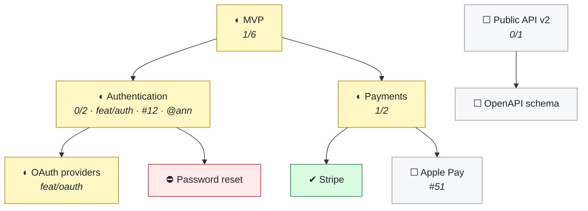

<picture>
  <source media="(prefers-color-scheme: dark)" srcset="docs/assets/hero-dark.svg">
  
</picture>

**English** · [Русский](docs/i18n/README.ru.md) · [中文](docs/i18n/README.zh-CN.md) · [Deutsch](docs/i18n/README.de.md) · [Français](docs/i18n/README.fr.md)

[](https://github.com/SergeyLubivui-dev/devtree/actions/workflows/ci.yml)
[](https://github.com/SergeyLubivui-dev/devtree/releases/latest)
[](https://github.com/SergeyLubivui-dev/devtree/pkgs/container/devtree)
[](https://pkg.go.dev/github.com/SergeyLubivui-dev/devtree)
[](LICENSE)

Your plan is a file — `.devtree/tree.yaml` — that sits next to the code. It is versioned with the
code, reviewed in the pull request, and merged line by line. From it, devtree draws a
[Mermaid](https://mermaid.js.org/) diagram into `TREE.md` or straight into your `README.md`, and a
picture of its own into `.svg` — as a tree, or as a board. GitHub and GitLab render both natively.
No browser extension, no image to regenerate by hand, nothing to host.

---

## Why keep the plan in the repository

<picture>
  <source media="(prefers-color-scheme: dark)" srcset="docs/assets/why-dark.svg">
  
</picture>

A roadmap in a tracker drifts away from the branch it describes. A roadmap in a wiki is read once
and never again. A roadmap in the repository is a file people already have habits for.

---

## How it works

<picture>
  <source media="(prefers-color-scheme: dark)" srcset="docs/assets/pipeline-dark.svg">
  
</picture>

---

## What it looks like

The Mermaid backend, which GitHub draws right here in the page:



The same plan in your terminal:

```text
Payment Gateway

◐ MVP  (mvp)  [1/6]
├─ ◐ Authentication  (authentication)  feat/auth  #12  @ann  [0/2]
│  ├─ ◐ OAuth providers  (oauth-providers)  feat/oauth
│  └─ ⛔ Password reset  (password-reset)
└─ ◐ Payments  (payments)  [1/2]
   ├─ ✔ Stripe  (stripe)
   └─ ☐ Apple Pay  (apple-pay)  #51
☐ Public API v2  (public-api-v2)  [0/1]
└─ ☐ OpenAPI schema  (openapi-schema)

██░░░░░░░░░░░░░░░░░░  1/9
```

And devtree's own drawing — [further down](#devtrees-own-plan), rendering this repository's plan.

---

## Install

```bash
go install github.com/SergeyLubivui-dev/devtree@latest
```

Prebuilt binaries for Linux, macOS, and Windows are attached to every
[release](https://github.com/SergeyLubivui-dev/devtree/releases/latest), with checksums. Or run it
without installing anything:

```bash
docker run --rm -v "$PWD:/work" ghcr.io/sergeylubivui-dev/devtree render
```

Building from source needs Go 1.22 and nothing else. Details, and a shell alias that makes the
container disappear into the background: [docs/container.md](docs/container.md).

---

## Quickstart

```bash
cd your-project

devtree init --project "Payment Gateway" --repo https://github.com/acme/pay --hook --action

devtree add "Authentication"  -p mvp -b feat/auth -i 12 -o ann -s wip
devtree add "OAuth providers" -p authentication -b feat/oauth
devtree add "Password reset"  -p authentication -s blocked -n "waiting on SMTP"

devtree ls                                   # the tree, in your terminal
devtree done oauth-providers
git add . && git commit -m "feat: oauth"     # the hook refreshes the diagram for you
```

IDs are derived from titles — "OAuth providers" becomes `oauth-providers`, and non-Latin titles are
transliterated so the ID stays typeable. Pass `--id` when you want to choose one yourself.

A longer walk through the same ground: [docs/getting-started.md](docs/getting-started.md).

---

## Everyday recipes

Short, real things people do with a plan. Copy one and change the words.

**Start a feature, finish a feature.** The task and the branch are named together, so anyone reading
the diagram knows where the code is:

```bash
devtree add "Search filters" -p mvp -b feat/search -i 214 -o you -s wip
git switch -c feat/search
# ...write the code...
devtree done search-filters
git commit -am "feat: search filters"        # the hook refreshes the diagram
```

**Break something big into something doable.** Parents count their children automatically, so the
milestone reports progress you never have to update by hand:

```bash
devtree add "Billing" -s wip
devtree add "Invoices" -p billing
devtree add "Refunds"  -p billing
devtree add "Dunning"  -p billing -s blocked -n "needs the payments API"
devtree ls
```

```text
◐ Billing  (billing)  [0/3]
├─ ☐ Invoices  (invoices)
├─ ☐ Refunds  (refunds)
└─ ⛔ Dunning  (dunning)
```

**Pick up a ticket.** Give it the issue number and it becomes a link in the table under the diagram:

```bash
devtree add "Fix timezone drift" -i 512 -o ann -s wip --tags bug
```

**Park what you cannot finish.** A blocked task with no note is the one thing `check` complains
about, because "blocked" without a reason is a task nobody can pick up:

```bash
devtree set password-reset -s blocked -n "waiting on the SMTP contract"
devtree board -s blocked
```

**Monday morning, in three commands:**

```bash
devtree board          # what is in flight, what is stuck, what is waiting
devtree ls -s blocked  # only the branches that need a decision
devtree check          # anything marked done that still has open work under it?
```

**Two people, two branches, one plan.** Both add tasks, both commit, and the merge is boring — the
node list is flat and `.gitattributes` says `merge=union`. If two branches happen to pick the same
ID, `devtree check` fails on the spot with the duplicate named.

---

## The board

The tree says how the work is organized. The board says what state it is in this morning — same
file, different question:

```bash
devtree board
```

```text
Payment Gateway

☐ not started · 1
  Apple Pay        Payments  #51

◐ in progress · 1
  OAuth providers  Authentication  !31

⛔ blocked · 1
  Password reset   Authentication  — waiting on SMTP

✔ done · 1
  Stripe           Payments  !44

██░░░░░░░░░░░░░░░░░░  1/7
```

Only leaves appear — a milestone is a container, not a card — and each task carries its milestone as
a breadcrumb. Name an output `board.svg` and the same thing is drawn as columns:

<picture>
  <source media="(prefers-color-scheme: dark)" srcset="docs/assets/board-dark.svg">
  
</picture>

More: [docs/board.md](docs/board.md).

---

## Finished work

A plan that keeps every task ever completed stops being a plan and becomes a log. Two commands
handle that from opposite ends:

```bash
devtree archive          # what is finished and could move
devtree archive --all    # move it into .devtree/archive.yaml
devtree restore v1       # bring a branch of it back

devtree sync             # tasks whose branch git has already merged
devtree sync --apply     # mark them done
```

Nothing moves until you say so, and a node qualifies only when its whole subtree is done or dropped,
so live work can never leave with the milestone above it. `sync` proposes rather than acts, because
git knows which branches were merged but not which of them were merged *finished*.

More: [docs/finished-work.md](docs/finished-work.md).

---

## Commands

| Command | What it does |
|---|---|
| `init [--project N] [--repo URL] [--outputs F] [--hook] [--action] [--empty]` | Creates `.devtree/tree.yaml`, `.gitattributes`, and the first diagram |
| `add "Title" [-p ID] [-s STATUS] [-b BRANCH] [-i N] [--pr N] [-o WHO] [--tags a,b] [-n NOTE] [--id ID]` | Adds a task |
| `set ID [--title T] [-s ...] [-p ...] [...]` | Changes fields; only the flags you pass are touched |
| `done ID [ID...]` | Marks tasks done |
| `mv ID PARENT\|root` | Re-parents a task |
| `rm ID [--cascade]` | Deletes a task; without `--cascade` its children move up to its parent |
| `ls [-s STATUS]` | Prints the tree in the terminal |
| `board [-s STATUS]` | Prints the work grouped by status |
| `archive [ID...] [--all] [--list]` | Moves finished branches of the plan into the archive |
| `restore ID [ID...]` | Brings archived work back |
| `sync [--apply]` | Closes tasks whose branch git has already merged |
| `render [--file F] [--quiet]` | Regenerates every output |
| `check [--strict]` | Validates the plan — for CI and hooks |
| `install hook\|action\|all` | Installs the pre-commit hook and the GitHub Action |
| `outputs` | Prints the files the diagram is written to |

Flags may come before or after the title, so both of these do the same thing:

```bash
devtree add "Authentication" -p mvp -s wip
devtree add -p mvp -s wip "Authentication"
```

### Statuses

<picture>
  <source media="(prefers-color-scheme: dark)" srcset="docs/assets/statuses-dark.svg">
  
</picture>

The canonical spelling is what lands in the file, whichever shorthand you type.

---

## Where the diagram goes

The plan lists its own output files, and the **name decides the drawing**:

| File name | What gets written |
|---|---|
| `TREE.md`, `README.md` | the Mermaid block, between `<!-- devtree:begin -->` and `<!-- devtree:end -->` markers |
| `docs/tree.svg` | devtree's own drawing of the tree, light palette |
| `docs/tree-dark.svg` | the same, dark palette |
| `docs/board.svg` | the board |

```yaml
outputs: "README.md, docs/tree.svg, docs/tree-dark.svg, docs/board.svg"
```

Everything outside the markers is left exactly as you wrote it, and re-rendering an unchanged plan
rewrites nothing at all. Point a `<picture>` at a light and dark pair and GitHub switches it with the
reader's theme.

Three things in the drawing move, and each one is information: a dash travels down the edges leading
into work in progress, a glyph turns while a task is in flight and breathes while it is blocked, and
progress bars grow in once. Readers who ask their system for less motion — and anyone printing —
get a still picture.

File naming rules, palettes, the animation vocabulary, and the content security policy all of it has
to survive: [docs/svg-output.md](docs/svg-output.md).

---

## Automation

```bash
devtree install hook      # validate and re-render before every commit
devtree install action    # fail a pull request whose diagram is out of date
```

The hook keeps your own commits honest; the Action keeps everyone else's honest without requiring
them to install anything. A teammate without devtree is never blocked — the hook notices the binary
is missing and steps aside. Line by line: [docs/automation.md](docs/automation.md).

---

## Documentation

This page is the tour. [`docs/`](docs/) is the detail underneath it.

| | |
|---|---|
| [Getting started](docs/getting-started.md) | A first plan, from an empty repository to a diagram in the README |
| [The file format](docs/file-format.md) | Every field, every rule, and what the parser refuses |
| [The board](docs/board.md) | Working by status instead of by structure |
| [Finished work](docs/finished-work.md) | Archiving, restoring, closing tasks from merged branches |
| [Automation](docs/automation.md) | The pre-commit hook and the GitHub Action, line by line |
| [SVG output](docs/svg-output.md) | File naming, palettes, the animation vocabulary, the CSP it survives |
| [The container](docs/container.md) | Running devtree without installing anything |
| [Architecture](docs/architecture.md) | The layering, the rules that hold it, and how it is tested |

---

## Limitations

- The storage format is a strict subset of YAML — a flat list of scalar fields. Anchors, multi-line
  block scalars, and nested mappings are rejected, with the line number.
- Nothing rendered into a README is clickable: GitHub's Mermaid ignores `click` directives, and an
  SVG served as an image is sandboxed. Links live in the collapsed table under the Mermaid block.
- Text in the SVG output is measured by estimate rather than by font metrics — shipping real metrics
  would mean shipping a font. Cards are sized a few pixels generously to compensate.
- Very wide trees (hundreds of nodes) render slowly in the browser. Split them across several output
  files with `--outputs`.

---

## devtree's own plan

Both of these come from the same `.devtree/tree.yaml` in this repository, regenerated on every
push. First the SVG backend — GitHub swaps the file when you switch themes:

<picture>
  <source media="(prefers-color-scheme: dark)" srcset="docs/assets/tree-dark.svg">
  
</picture>

And the same plan as a Mermaid block, injected straight into this README:

<!-- devtree:begin -->
<!-- Generated by devtree. Do not edit by hand: edit .devtree/tree.yaml instead. -->

## 🌳 devtree

████████████░░░░░░░░ **15 / 24** tasks done

```mermaid
flowchart TD
    classDef todo fill:#f6f8fa,stroke:#8c959f,color:#1f2328
    classDef in_progress fill:#fff8c5,stroke:#bf8700,color:#1f2328
    classDef blocked fill:#ffebe9,stroke:#cf222e,color:#1f2328
    classDef done fill:#dafbe1,stroke:#1a7f37,color:#1f2328
    classDef dropped fill:#eaeef2,stroke:#8c959f,color:#6e7781,stroke-dasharray:4 3
    n_v0_1["✔ v0.1 - first release<br/><i>6/6</i>"]:::done
    n_v0_1 --> n_domain
    n_domain["✔ Domain model and validation"]:::done
    n_v0_1 --> n_format
    n_format["✔ Strict YAML subset parser"]:::done
    n_v0_1 --> n_diagram
    n_diagram["✔ Mermaid renderer"]:::done
    n_v0_1 --> n_cli
    n_cli["✔ Command line"]:::done
    n_v0_1 --> n_automation
    n_automation["✔ Pre-commit hook and GitHub Action"]:::done
    n_v0_1 --> n_tests
    n_tests["✔ Test suite"]:::done
    n_v0_2["◐ v0.2 - sharper day-to-day use<br/><i>6/11</i>"]:::in_progress
    n_v0_2 --> n_filters
    n_filters["☐ Filter ls by owner and tag"]:::todo
    n_v0_2 --> n_focus
    n_focus["☐ Render one subtree with --root"]:::todo
    n_v0_2 --> n_open
    n_open["☐ devtree open ID - jump to the issue or PR"]:::todo
    n_v0_2 --> n_history
    n_history["☐ Progress history from git log"]:::todo
    n_v0_2 --> n_svg_output
    n_svg_output["✔ Native SVG output with embedded icons"]:::done
    n_v0_2 --> n_html_export
    n_html_export["☐ Interactive HTML export"]:::todo
    n_v0_2 --> n_animation
    n_animation["✔ Animation in the SVG output"]:::done
    n_v0_2 --> n_board
    n_board["✔ Board layout, in the terminal and in SVG"]:::done
    n_v0_2 --> n_archive
    n_archive["✔ Archive and restore finished work"]:::done
    n_v0_2 --> n_sync
    n_sync["✔ Close tasks from merged branches"]:::done
    n_v0_2 --> n_docs_layout
    n_docs_layout["✔ Documentation folder and a tidy root"]:::done
    n_distribution["◐ Distribution<br/><i>2/4</i>"]:::in_progress
    n_distribution --> n_binaries
    n_binaries["✔ Prebuilt binaries on every tag"]:::done
    n_distribution --> n_homebrew
    n_homebrew["☐ Homebrew tap"]:::todo
    n_distribution --> n_gitlab
    n_gitlab["☐ GitLab CI template"]:::todo
    n_distribution --> n_container
    n_container["✔ Container image on GHCR"]:::done
```



> ☐ not started · ◐ in progress · ⛔ blocked · ✔ done · ✖ dropped

<!-- devtree:end -->

## Contributing

Issues and pull requests are welcome. [CONTRIBUTING.md](CONTRIBUTING.md) covers the checks CI runs,
which package new code belongs in, and the two rules the layering depends on.

## License

[MIT](LICENSE) © SergeyLubivui-dev

The vector glyphs in `internal/icons` are vendored from [Reicon](https://reicon.dev), also MIT —
see [NOTICE](NOTICE).
