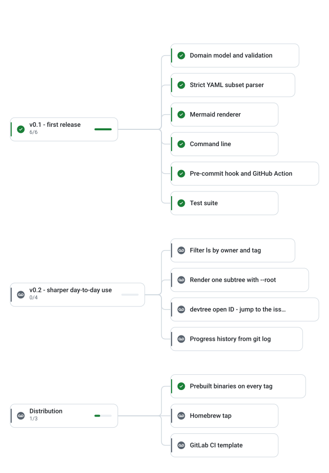

# SVG rendering spike

Throwaway branch. Question: how does GitHub render a repository-local SVG referenced from
Markdown, and which theming approach survives the trip through the camo image proxy?

Three candidates, same plan, same renderer.

## 1. Two files, `<picture>` with `prefers-color-scheme`

<picture>
  <source media="(prefers-color-scheme: dark)" srcset="spike/tree-dark.svg">
  
</picture>

## 2. One file that themes itself

A single SVG whose colors are custom properties, swapped by a `@media (prefers-color-scheme: dark)`
rule in an inline `<style>`. If this works, the renderer emits one file instead of two.

## 3. Plain image, light palette only

The baseline: does a repo-local SVG render at all, with text, icons, and rounded shapes intact?

