<!-- devtree:begin -->
<!-- Generated by devtree. Do not edit by hand: edit .devtree/tree.yaml instead. -->

## 🌳 devtree

██████████████████░░ **23 / 25** tasks done

```mermaid
flowchart TD
    classDef todo stroke:#8c959f,stroke-width:1.5px
    classDef in_progress stroke:#bf8700,stroke-width:2px
    classDef blocked stroke:#cf222e,stroke-width:2px
    classDef done stroke:#1a7f37,stroke-width:2px
    classDef dropped stroke:#8c959f,stroke-width:1.5px,stroke-dasharray:4 3
    n_v0_1["✔ v0.1 - first release<br/><i>6/6</i>"]:::done
    n_v0_1 --> n_domain
    n_domain["✔ Domain model and validation"]:::done
    n_v0_1 --> n_format
    n_format["✔ Strict YAML subset parser"]:::done
    n_v0_1 --> n_diagram
    n_diagram["✔ Mermaid renderer"]:::done
    n_v0_1 --> n_cli
    n_cli["✔ Command line"]:::done
    n_v0_1 --> n_automation
    n_automation["✔ Pre-commit hook and GitHub Action"]:::done
    n_v0_1 --> n_tests
    n_tests["✔ Test suite"]:::done
    n_v0_2["◐ v0.2 - sharper day-to-day use<br/><i>12/12</i>"]:::in_progress
    n_v0_2 --> n_filters
    n_filters["✔ Filter ls by owner and tag"]:::done
    n_v0_2 --> n_focus
    n_focus["✔ Render one subtree with --root"]:::done
    n_v0_2 --> n_open
    n_open["✔ devtree open ID - jump to the issue or PR"]:::done
    n_v0_2 --> n_history
    n_history["✔ Progress history from git log"]:::done
    n_v0_2 --> n_svg_output
    n_svg_output["✔ Native SVG output with embedded icons"]:::done
    n_v0_2 --> n_html_export
    n_html_export["✔ Interactive HTML export"]:::done
    n_v0_2 --> n_animation
    n_animation["✔ Animation in the SVG output"]:::done
    n_v0_2 --> n_board
    n_board["✔ Board layout, in the terminal and in SVG"]:::done
    n_v0_2 --> n_archive
    n_archive["✔ Archive and restore finished work"]:::done
    n_v0_2 --> n_sync
    n_sync["✔ Close tasks from merged branches"]:::done
    n_v0_2 --> n_docs_layout
    n_docs_layout["✔ Documentation folder and a tidy root"]:::done
    n_v0_2 --> n_editor
    n_editor["✔ Local editor on 127.0.0.1"]:::done
    n_distribution["◐ Distribution<br/><i>4/4</i>"]:::in_progress
    n_distribution --> n_binaries
    n_binaries["✔ Prebuilt binaries on every tag"]:::done
    n_distribution --> n_homebrew
    n_homebrew["✔ Homebrew tap"]:::done
    n_distribution --> n_gitlab
    n_gitlab["✔ GitLab CI template"]:::done
    n_distribution --> n_container
    n_container["✔ Container image on GHCR"]:::done
```

> ☐ not started · ◐ in progress · ⛔ blocked · ✔ done · ✖ dropped

<!-- devtree:end -->
