# Architecture

<picture>
  <source media="(prefers-color-scheme: dark)" srcset="assets/architecture-dark.svg">
  
</picture>

Every box may import the boxes inside it. Nothing imports outward.

| Package | Holds | May import |
|---|---|---|
| `internal/tree` | nodes, parents, statuses, validation, progress | standard library only |
| `internal/icons` | vendored glyph paths | standard library only |
| `internal/draw` | measuring, wrapping, escaping, glyph placement, the animation vocabulary | `icons` |
| `internal/store` | the strict YAML subset: parse, marshal, atomic save, the archive | `tree` |
| `internal/render` | Mermaid, Markdown injection, the ASCII tree and board | `tree` |
| `internal/render/svg` | layout, cards, themes, the board, output naming | `tree`, `draw` |
| `internal/scaffold` | hook, workflow, and `.gitattributes` templates | — |
| `internal/vcs` | the one place that runs git | — |
| `internal/cli` | flags, dispatch, and every line the user sees | all of the above |
| `internal/art` | the documentation pictures; a tool, not part of the binary | `draw`, `render/svg` |

`main.go` is about twenty lines: it wires `cli` to the process and exits.

## Three rules that hold it together

**Only the CLI prints.** Everywhere else, return a value or an error and let the caller decide how
to say it. This is what makes the whole program testable without capturing output — and it is why
`scaffold` returns a `Result` describing what it did instead of printing it.

**Only `main` exits.** Commands return errors; `Execute` turns them into an exit code. Nothing
buried three layers down can end the program.

**The domain knows nothing about the outside.** `internal/tree` does not know a file format exists,
and it certainly does not know about Mermaid. The rules about what a valid plan *is* live in one
place and stay there, which is why adding the SVG renderer and the board did not touch them.

## Why the layers came out this way

`internal/draw` was extracted when the documentation artwork appeared. Without it, a card in the
README diagram and a card in your plan would be two implementations that happen to look alike, and
they would drift the first time one of them was adjusted. Now they are the same code, so they
cannot.

`internal/vcs` exists so that the dependency on git is visible in the import graph rather than
hidden in a helper. Everything else works on the plan file alone, which is what lets devtree run
against a tarball or inside a container with no repository in sight.

## Testing

```bash
go test ./...
go test -race ./...
```

`App` takes its working directory and its two writers as fields, so a test drives a whole command
against a temporary directory and reads back exactly what a user would have seen:

```go
h := newHarness(t)
h.run("init", "--empty")
h.run("add", "Authentication", "-s", "wip")
out := h.run("board")
```

Some things are checked in ways worth copying:

- **Well-formedness, not string matching.** Every rendered SVG is walked with an XML decoder, which
  fails on an unescaped angle bracket anywhere in the document — the failure mode that turns a
  diagram into a browser error page.
- **Determinism as a test.** Rendering the same plan twice must produce identical bytes, because
  everything downstream (the hook, the CI staleness check) treats "the file changed" as "something
  changed".
- **Round-trip stability.** Parsing a plan and writing it back must produce the same bytes.
- **git-dependent tests skip themselves** when git is missing rather than failing.

CI runs the suite on Linux, macOS, and Windows, checks `gofmt` and `go vet`, then regenerates every
diagram and every documentation picture and fails if a committed file differs.

## Adding something

The question to ask is which box it belongs in, and the answer is usually the innermost one that can
hold it. A new field on a node is `tree` plus `store`. A new drawing is `render/svg`. A new command
is `cli` and nothing else — if it needs more than that, the thing it needs probably belongs one
layer down.
