# The board

The tree says how the work is organized. The board says what state it is in this morning. Same file,
different question — nothing is stored twice, and nothing can disagree.

```bash
devtree board
devtree board -s blocked    # one column only
```

```text
Payment Gateway

☐ not started · 1
  Apple Pay        Payments  #51

◐ in progress · 1
  OAuth providers  Authentication  !31

⛔ blocked · 1
  Password reset   Authentication  — waiting on SMTP

✔ done · 1
  Stripe           Payments  !44

██░░░░░░░░░░░░░░░░░░  1/7
```

## Only leaves appear

A milestone is a container, not a task. A board that lists containers next to the work inside them
makes both harder to scan: the milestone shows up as a card you cannot pick up, and its progress is
already visible from the cards underneath it.

So the board shows leaves, and each card carries its milestone as a breadcrumb instead. Nothing
loses its place, and every card on the board is something a person could actually start.

## Empty columns are dropped

A board with nothing blocked should not spend a fifth of its width saying so. Columns appear only
when they have work in them, in the canonical status order — not started, in progress, blocked,
done, dropped.

## Why the terminal stacks instead of columns

Real side-by-side columns wrap into porridge the moment a terminal is narrower than the layout
assumed, and terminals are narrow at exactly the moment you most want a quick look. Stacking the
statuses keeps every line readable at any width, and the group headings carry the counts.

Alignment counts runes, not bytes. A Cyrillic or CJK title would otherwise throw the second column
out by the number of multi-byte characters in it.

## The same board as a picture

Name an output `board.svg` — or `anything.board.svg` — and the board is what gets drawn:

```bash
devtree init --outputs "docs/tree.svg, docs/board.svg, docs/board-dark.svg"
```

<picture>
  <source media="(prefers-color-scheme: dark)" srcset="assets/board-dark.svg">
  
</picture>

Columns get a heading with the status glyph and a count, a hairline in the status color, and cards
that carry the same full-height accent stripe as the tree diagram. The rules above hold here too:
leaves only, empty columns dropped.

## What it is not

There are no WIP limits, no swimlanes, no drag and drop, and no state that lives anywhere but the
plan file. The board is a view. If you want a task to move, change its status:

```bash
devtree set apple-pay -s wip
devtree done apple-pay
```

And when the done column has grown into a wall, move it out of the way — see
[Finished work](finished-work.md).
