# Drawing components

The vocabulary every devtree diagram is assembled from: twenty components sitting between the
primitives that write SVG and a finished picture.

<picture>
  <source media="(prefers-color-scheme: dark)" srcset="assets/components-dark.svg">
  
</picture>

That picture is generated by walking the component list, so it cannot go stale: a component added
without a demo fails the build rather than quietly going undocumented.

## The twenty

| | | |
|---|---|---|
| **Card** a panel with an accent edge | **Cluster** a dashed box around a region | **Callout** a bordered note |
| **Swimlane** a labelled band | **ColumnHead** a board column heading | **Stat** one number, said loudly |
| **Chip** a small labelled tag | **Badge** a count | **Pill** a state, in a wash of its colour |
| **Avatar** an owner as initials | **Milestone** a point, not a span | **Legend** the key to a drawing |
| **Bar** progress along a line | **Ring** the same, in a circle | **Sparkline** which way it is going |
| **Timeline** an axis with ticks | **Divider** a hairline | **Connector** a rounded elbow |
| **Arrow** a connector with a direction | **Brace** these belong together | |

## Two rules

**A component knows nothing about development plans.** There is no status here, no task and no
tree: a `Pill` takes a colour and a label, and the renderer above decides that "blocked" is red.
That is what lets the illustrations in this documentation use the same components as the diagrams
without either one bending to fit the other — and it is why the theme is translated into a
`parts.Palette` in exactly one place rather than passed through.

**A component writes SVG and nothing else.** Nothing measures a browser, fetches anything, or needs
a font installed. The same bytes have to draw identically in a README on GitHub, in a preview
launched from a terminal, and on paper printed by somebody with no network — which is also why
`Avatar` draws initials rather than a photograph, and why `Arrow` draws its head as a path rather
than as a marker element.

## The instrumentation underneath

Components are placed with a `Rect` rather than four loose numbers.

```go
head, body := card.SplitTop(34)     // a band off the top, and what is left
meta, body := body.SplitBottom(20)
inner := body.InsetXY(12, 8)
cols := inner.Columns(3, 10)        // three columns with a gap between them
```

Diagram code that carries `x, y, w, h` separately spends most of its length recomputing them — a
title at `x+14`, a badge at `x+w-40` — and every one of those is a place to be off by two, none of
which says what it meant. Splitting says it once, and the pieces provably still add up to what you
started with.

Alongside it, the measuring that drawing text actually needs:

| | |
|---|---|
| `FitSize` | shrink a font until it fits, and give up at a floor rather than at nothing |
| `Lines` | wrap into at most *n* lines, the last one ending in `…` rather than simply stopping |
| `Clip` | one line, cut with an ellipsis |
| `Initials` | `"Ann Marie"` → `AM`, `"@bob"` → `B` |
| `Plural` | `1 task`, `2 tasks` |
| `Percent` | progress as a whole number, with nothing to divide by treated as nothing done |

## Using them

```go
p := theme.Palette()

parts.Card(&b, box, p, parts.CardStyle{
    Accent: theme.Blocked,
    Title:  "Authentication",
    Meta:   "feat/auth · ann · #12",
    Glyph:  "lock-circle",
    Motion: draw.ClassPulse,
    Trailer: func(b *strings.Builder, r draw.Rect) {
        parts.Bar(b, r, p, 3, 7, theme.Done, draw.ClassGrow)
    },
})
```

Components that flow — `Chip`, `Badge`, `Pill`, `Legend` — return the width they used, so a row of
them is laid out without measuring the same string twice:

```go
at := box.X
at += parts.Chip(&b, at, y, p, "share", "feat/auth", "") + 8
at += parts.Chip(&b, at, y, p, "user", "ann", "") + 8
```

Every optional part is genuinely optional. A chip with no icon costs nothing and leaves no hole, so
there is one `Chip` rather than a `Chip` and a `ChipWithIcon`.

## Motion

Any component that can move takes a class rather than deciding for itself, because whether a thing
should be moving is a fact about the diagram, not about the shape: the bar grows on load, the
blocked pill breathes, the connector on the live path carries a travelling dash.

| Class | What it does |
|---|---|
| `ClassGrow` | fills a bar from its left edge, once |
| `ClassDraw` | writes a stroked path on — a sparkline, a connector, the arc of a ring |
| `ClassRoll` | steps a number up to its value, one written value at a time |
| `ClassFlow` | sends a dash travelling along a stroke, repeating |
| `ClassSpin` | turns the ring of a progress glyph, leaving the check inside it still |
| `ClassPulse` | breathes, slowly, for work that is blocked |
| `ClassRise` | fades a card up into place, staggered, once |

Two of those are worth a note.

`ClassDraw` works on any path of any length because the element declares `pathLength="1"`: the
renderer then measures the path as a single unit whatever its real length, so one rule serves a
sparkline, an elbow connector and a 42% arc. How much ends up drawn is the element's own
`--dt-draw`, which is also where the dash starts from — one number doing both jobs, so the two
cannot disagree.

`ClassRoll` steps rather than interpolates. The values are laid out as a column and the column is
stepped past a window, so every frame shows a number somebody actually wrote: a counter easing
through 7.4 on its way to 12 is telling the reader something untrue about a total. It settles on the
last value, so the still frame — printed, or read with motion off — is the real figure.

All of it is the same guarded stylesheet as the rest of devtree: nothing moves under
`prefers-reduced-motion`, and nothing moves on paper. The two that carry their own dash and offset
say so explicitly in the guard, because switching an animation off must leave the finished state
rather than the first frame of it.

See [the SVG output](svg-output.md) for what each animation means.
