<picture>
  <source media="(prefers-color-scheme: dark)" srcset="../assets/hero-dark.svg">
  
</picture>

[English](../../README.md) · [Русский](README.ru.md) · [中文](README.zh-CN.md) · [Deutsch](README.de.md) · **Français**

[](https://github.com/SergeyLubivui-dev/devtree/actions/workflows/ci.yml)
[](https://github.com/SergeyLubivui-dev/devtree/releases/latest)
[](../../LICENSE)

Votre plan est un fichier — `.devtree/tree.yaml` — posé à côté du code. Il est versionné avec le
code, relu dans la pull request et fusionné ligne à ligne. À partir de lui, devtree génère un
diagramme [Mermaid](https://mermaid.js.org/) dans `TREE.md` ou directement dans votre `README.md`,
ainsi qu'un dessin qui lui est propre en `.svg`. GitHub et GitLab affichent les deux nativement :
aucune extension de navigateur, aucune image à réexporter à la main, rien à héberger.

---

## Pourquoi garder le plan dans le dépôt

<picture>
  <source media="(prefers-color-scheme: dark)" srcset="../assets/why-dark.svg">
  
</picture>

- **Il est relu.** Une modification du plan apparaît dans le diff, juste à côté de la modification du
  code.
- **Il se fusionne.** La liste de nœuds est plate : deux branches ayant chacune ajouté une tâche
  fusionnent sans conflit.
- **Il reste honnête.** Un hook de pre-commit et une vérification en CI empêchent le diagramme de
  s'écarter du plan.

Une feuille de route dans un outil de tickets s'éloigne de la branche qu'elle décrit. Une feuille de
route dans un wiki est lue une seule fois. Une feuille de route dans le dépôt est un fichier pour
lequel les habitudes existent déjà.

---

## Comment ça marche

<picture>
  <source media="(prefers-color-scheme: dark)" srcset="../assets/pipeline-dark.svg">
  
</picture>

---

## Installation

```bash
go install github.com/SergeyLubivui-dev/devtree@latest
```

Des binaires précompilés pour Linux, macOS et Windows sont joints à chaque
[release](https://github.com/SergeyLubivui-dev/devtree/releases/latest), avec leurs sommes de
contrôle. Ou compilez depuis les sources — rien d'autre que Go 1.22 ou plus récent :

```bash
git clone https://github.com/SergeyLubivui-dev/devtree.git
cd devtree
go test ./...
go build -o devtree .
```

### Dans un conteneur

Si vous préférez ne rien installer du tout, montez le dépôt et lancez l'image :

```bash
docker run --rm -v "$PWD:/work" ghcr.io/sergeylubivui-dev/devtree render
docker run --rm -v "$PWD:/work" ghcr.io/sergeylubivui-dev/devtree board
```

Sous Linux, ajoutez `--user "$(id -u):$(id -g)"` pour que les fichiers écrits vous appartiennent au
lieu d'appartenir à root. Le tag `latest` suit la dernière release, `edge` suit `main` ; les deux sont
publiés pour `amd64` et `arm64`. L'image embarque git, donc `devtree sync` y fonctionne aussi — c'est
la seule raison pour laquelle elle n'est pas construite `FROM scratch`.

---

## Démarrage rapide

```bash
cd votre-projet

devtree init --project "Payment Gateway" --repo https://github.com/acme/pay --hook --action

devtree add "Authentication"  -p mvp -b feat/auth -i 12 -o ann -s wip
devtree add "OAuth providers" -p authentication -b feat/oauth
devtree add "Password reset"  -p authentication -s blocked -n "en attente du SMTP"

devtree ls                                   # l'arbre, dans votre terminal
devtree done oauth-providers
git add . && git commit -m "feat: oauth"     # le hook rafraîchit le diagramme
```

Les identifiants sont dérivés des titres — « OAuth providers » devient `oauth-providers` — et les
titres non latins sont translittérés pour que l'identifiant reste tapable. Utilisez `--id` pour le
choisir vous-même.

---

## Recettes du quotidien

Des choses courtes et réelles que l'on fait avec un plan. Copiez-en une, changez les mots.

**Commencer une fonctionnalité, la terminer.** La tâche et la branche sont nommées ensemble : qui lit
le diagramme sait où se trouve le code.

```bash
devtree add "Search filters" -p mvp -b feat/search -i 214 -o you -s wip
git switch -c feat/search
# ...on écrit le code...
devtree done search-filters
git commit -am "feat: search filters"        # le hook rafraîchit le diagramme
```

**Découper le gros en faisable.** Les parents comptent leurs enfants tout seuls : l'avancement d'un
jalon n'est jamais à mettre à jour à la main.

```bash
devtree add "Billing" -s wip
devtree add "Invoices" -p billing
devtree add "Refunds"  -p billing
devtree add "Dunning"  -p billing -s blocked -n "dépend de l'API paiements"
devtree ls
```

**Prendre un ticket.** Donnez-lui le numéro de l'issue et il devient un lien dans le tableau sous le
diagramme :

```bash
devtree add "Fix timezone drift" -i 512 -o ann -s wip --tags bug
```

**Mettre de côté ce qui est bloqué.** Une tâche bloquée sans note est la seule chose dont `check` se
plaint : « bloqué » sans raison, personne ne peut le reprendre.

```bash
devtree set password-reset -s blocked -n "en attente du contrat SMTP"
devtree board -s blocked
```

**Le lundi matin, en trois commandes :**

```bash
devtree board          # ce qui avance, ce qui coince, ce qui attend
devtree ls -s blocked  # seulement les branches qui demandent une décision
devtree check          # quelque chose marqué terminé avec du travail encore ouvert dessous ?
```

**Deux personnes, deux branches, un plan.** Chacun ajoute ses tâches, chacun commite, et la fusion
est sans histoire : la liste de nœuds est plate et `.gitattributes` dit `merge=union`. Si deux
branches choisissent le même identifiant, `devtree check` échoue aussitôt en nommant le doublon.

---

## Le tableau

L'arbre dit comment le travail est organisé. Le tableau dit dans quel état il se trouve ce matin.
Même fichier, deux questions :

```bash
devtree board
```

```text
Payment Gateway

☐ not started · 1
  Apple Pay        Payments  #51

◐ in progress · 1
  OAuth providers  Authentication  !31

⛔ blocked · 1
  Password reset   Authentication  — en attente du SMTP

✔ done · 1
  Stripe           Payments  !44
```

Seules les feuilles apparaissent. Un jalon est un conteneur, pas une tâche, et un tableau qui liste
les conteneurs à côté du travail qu'ils contiennent cesse d'être un tableau — chaque carte porte donc
son jalon en fil d'Ariane. Les colonnes vides ne sont pas dessinées du tout.

Le même tableau se rend en SVG : il suffit de nommer le fichier de sortie `board.svg` :

<picture>
  <source media="(prefers-color-scheme: dark)" srcset="../assets/board-dark.svg">
  
</picture>

---

## Travail terminé

Un plan qui conserve chaque tâche jamais achevée cesse d'être un plan et devient un journal : le
tableau se remplit de colonnes de travail terminé et le diagramme se dote d'une queue que personne
ne lit. L'archive garde la trace sans garder le bruit.

```bash
devtree archive          # ce qui est terminé et pourrait déménager
devtree archive --all    # déplacer vers .devtree/archive.yaml
devtree archive v1       # ou seulement cette branche du plan
devtree archive --list   # ce qui est déjà parti
devtree restore v1       # le ramener, avec tout ce qui est dessous
```

Rien ne bouge tant que vous ne le dites pas : `devtree archive` seul se contente de rapporter. Un
nœud n'est éligible que si tout son sous-arbre est `done` ou `dropped` : le travail vivant ne peut
donc jamais disparaître avec le jalon qui le surplombe. Les tâches archivées conservent leur parent,
c'est ainsi qu'elles se souviennent d'où elles viennent ; si ce parent a disparu au moment du
retour, la tâche revient à la racine et vous le dit.

L'archive utilise le même format que le plan : aucun second analyseur à apprendre, rien de nouveau
dans le diff.

**Clore ce que git sait déjà :**

```bash
devtree sync           # lister les tâches dont la branche est déjà fusionnée
devtree sync --apply   # et les marquer terminées
```

La commande propose au lieu d'agir. git sait quelles branches ont été fusionnées, pas lesquelles
l'ont été *terminées* : une branche fusionnée derrière un drapeau de fonctionnalité n'est pas une
tâche achevée. C'est la seule commande qui lance un autre programme ; tout le reste travaille sur le
seul fichier.

---

## Commandes

| Commande | Ce qu'elle fait |
|---|---|
| `init [--project N] [--repo URL] [--outputs F] [--hook] [--action] [--empty]` | Crée `.devtree/tree.yaml`, `.gitattributes` et le premier diagramme |
| `add "Titre" [-p ID] [-s STATUT] [-b BRANCHE] [-i N] [--pr N] [-o QUI] [--tags a,b] [-n NOTE] [--id ID]` | Ajoute une tâche |
| `set ID [--title T] [-s ...] [-p ...] [...]` | Modifie des champs ; seuls les drapeaux passés sont touchés |
| `done ID [ID...]` | Marque des tâches comme terminées |
| `mv ID PARENT\|root` | Rattache une tâche à un autre parent |
| `rm ID [--cascade]` | Supprime une tâche ; sans `--cascade`, ses enfants remontent à son parent |
| `ls [-s STATUT]` | Affiche l'arbre dans le terminal |
| `board [-s STATUT]` | Affiche le travail groupé par statut |
| `open ID [--issue\|--pr\|--branch] [--print]` | Ouvre ce que la tâche désigne |
| `archive [ID...] [--all] [--list]` | Déplace les branches terminées du plan vers l'archive |
| `restore ID [ID...]` | Ramène du travail archivé |
| `sync [--apply]` | Clôt les tâches dont la branche est déjà fusionnée par git |
| `render [--file F] [--quiet]` | Régénère toutes les sorties |
| `check [--strict]` | Valide le plan — pour la CI et les hooks |
| `install hook\|action\|all` | Installe le hook de pre-commit et la GitHub Action |
| `outputs` | Affiche les fichiers de sortie |

`ls` et `board` acceptent les quatre mêmes filtres, et ils se combinent : `-s STATUT`, `-o QUI`,
`--tag a,b` (l'un suffit), `--root ID` (une seule branche du plan). `render` accepte `--root` aussi,
si bien qu'un jalon peut avoir son propre dessin :

```bash
devtree board -o ann --tag billing
devtree render --root mvp --file docs/mvp.svg
devtree open authentication          # ouvre la pull request, l'issue ou la branche
```

Les drapeaux peuvent précéder ou suivre le titre, les deux formes sont équivalentes :

```bash
devtree add "Authentication" -p mvp -s wip
devtree add -p mvp -s wip "Authentication"
```

### Statuts

<picture>
  <source media="(prefers-color-scheme: dark)" srcset="../assets/statuses-dark.svg">
  
</picture>

C'est toujours l'orthographe canonique qui atterrit dans le fichier, quelle que soit l'abréviation
tapée.

---

## Le format de fichier

```yaml
version: 1
project: "Payment Gateway"
repo: "https://github.com/acme/pay"
outputs: "TREE.md"
nodes:
  - id: "mvp"
    title: "MVP"
    status: "in_progress"
  - id: "auth"
    title: "Authentication"
    status: "in_progress"
    parent: "mvp"
    branch: "feat/auth"
    issue: "12"
    owner: "ann"
```

La liste est **plate** ; la hiérarchie vient du champ `parent`. C'est un compromis assumé.
L'imbrication signifierait qu'ajouter une tâche réécrit un bloc existant — exactement la forme qui
fait entrer deux branches en conflit. Une liste plate transforme « ajouter une tâche » en « ajouter
des lignes », donc les branches parallèles fusionnent proprement, et `init` écrit en plus une règle
`merge=union` dans `.gitattributes`. Au pire, il reste un identifiant en double, que `devtree check`
attrape immédiatement.

Le fichier se modifie à la main quand vous voulez. L'analyseur est strict et donne le numéro de ligne :

```text
devtree: .devtree/tree.yaml: line 14: unknown node field "assignee"
```

---

## Automatisation

**Hook de pre-commit** — `devtree install hook`. Il valide le plan, régénère toutes les sorties et
les ajoute au commit en cours. Un hook existant est conservé sous `pre-commit.devtree-backup`. Les
collègues qui n'ont pas installé devtree ne sont pas bloqués : le hook constate l'absence du binaire
et s'efface.

**GitHub Action** — `devtree install action`. Sur `pull_request`, l'exécution échoue si le diagramme
est périmé, pour que l'auteur le corrige dans son propre diff ; sur `push` vers la branche par
défaut, il est rafraîchi et commité automatiquement.

---

## Dessiner en SVG

Mermaid a un plafond : GitHub l'affiche avec un nettoyeur strict et une CSP au niveau de la page, si
bien qu'un nœud du diagramme ne peut porter ni icône ni lien. Un fichier que devtree dessine lui-même
n'a pas ce plafond. Le nom du fichier décide de tout :

| Nom du fichier | Ce qui est dessiné |
|---|---|
| `TREE.md`, `README.md` | le bloc Mermaid, entre les marqueurs |
| `docs/assets/tree.svg` | l'arbre, palette claire |
| `docs/assets/tree-dark.svg` | l'arbre, palette sombre |
| `docs/assets/board.svg` | le tableau |

Ne bouge que ce qui porte une information : un tiret parcourt l'arête qui mène à un travail en cours ;
une icône tourne quand la tâche avance et respire quand elle est bloquée — le seul état pour lequel il
vaut la peine d'interrompre la lecture ; une barre de progression grandit une fois au chargement ; les
cartes apparaissent en cascade plutôt que d'un bloc. En haut de ce fichier, un bandeau de cartes défile
sans fin. Tout le reste est immobile.

Qui demande moins d'animation à son système obtient une image fixe. À l'impression, les animations sont
coupées : un moteur de rendu figé sur la première image d'un fondu imprimerait sinon une carte vide.

Les glyphes proviennent de [Reicon](https://reicon.dev) (MIT), stockés comme données de chemin dans
`internal/icons` — voir [NOTICE](../../NOTICE). Rien n'est téléchargé au moment du rendu, et le binaire
reste sans dépendances.

---

## Limites

- Le format de stockage est un sous-ensemble strict de YAML : une liste plate de champs scalaires.
  Ancres, blocs multilignes et structures imbriquées sont refusés, avec le numéro de ligne.
- Rien de ce qui est rendu dans un README n'est cliquable : le Mermaid de GitHub ignore les
  directives `click`, et un SVG servi comme image est en bac à sable. Les liens vivent dans le
  tableau repliable sous le diagramme.
- Le texte du SVG est estimé plutôt que mesuré sur les métriques de la police — sinon il faudrait
  livrer une police. Les cartes sont donc dimensionnées un peu large.
- Les arbres très larges (des centaines de nœuds) sont lents à afficher ; répartissez-les sur
  plusieurs fichiers de sortie avec `--outputs`.

---

## Documentation

Cette page est la visite guidée ; le détail est dans [`docs/`](../) :
[premiers pas](../getting-started.md), [le format de fichier](../file-format.md),
[le tableau](../board.md), [le travail terminé](../finished-work.md),
[l'automatisation](../automation.md), [la sortie SVG](../svg-output.md),
[le conteneur](../container.md), [l'architecture](../architecture.md). Ces pages sont en anglais.

---

## Licence

[MIT](../../LICENSE) © SergeyLubivui-dev

Les glyphes vectoriels de `internal/icons` proviennent de [Reicon](https://reicon.dev), également
sous MIT — voir [NOTICE](../../NOTICE).

> La documentation complète, y compris la section sur l'architecture du projet, se trouve dans la
> [version anglaise](../../README.md).
